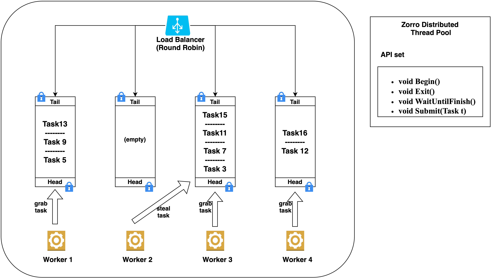
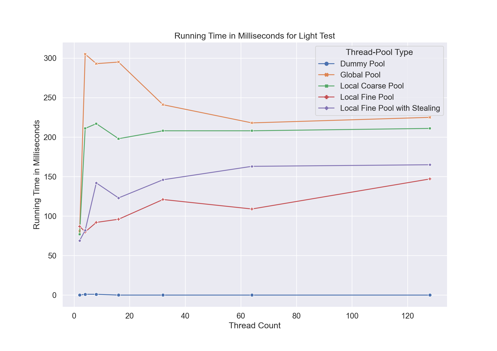
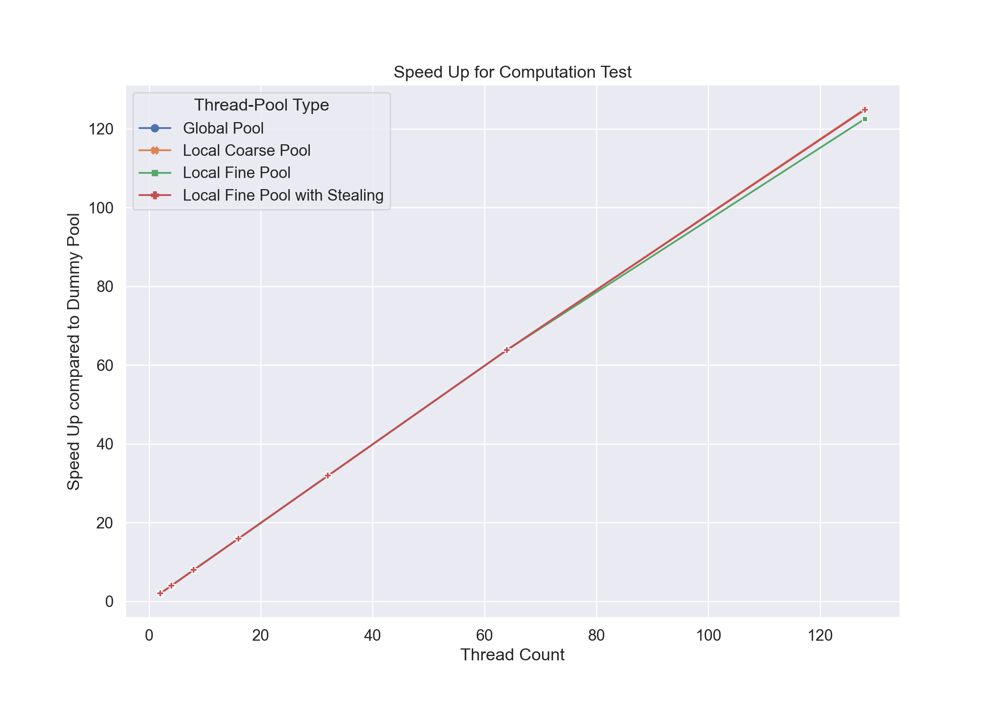
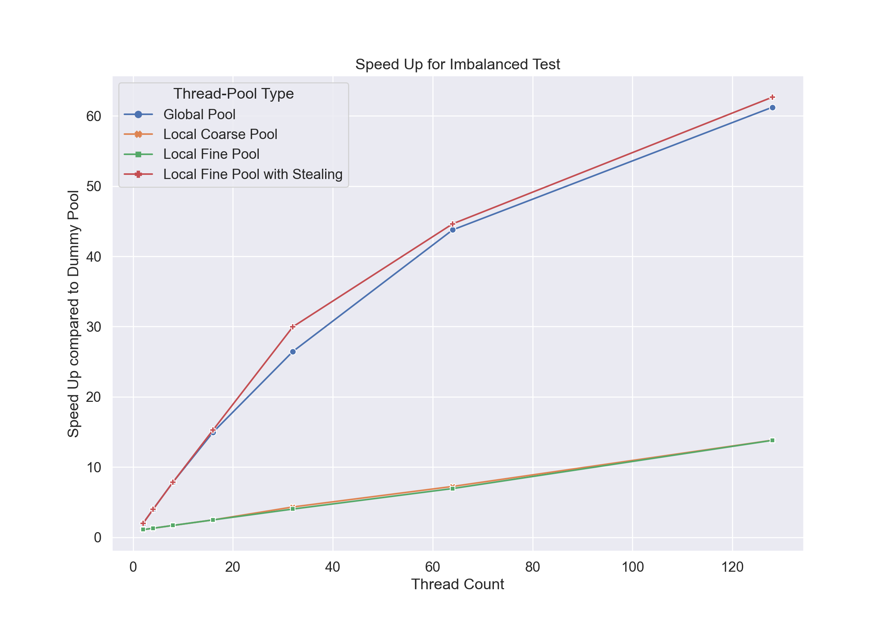
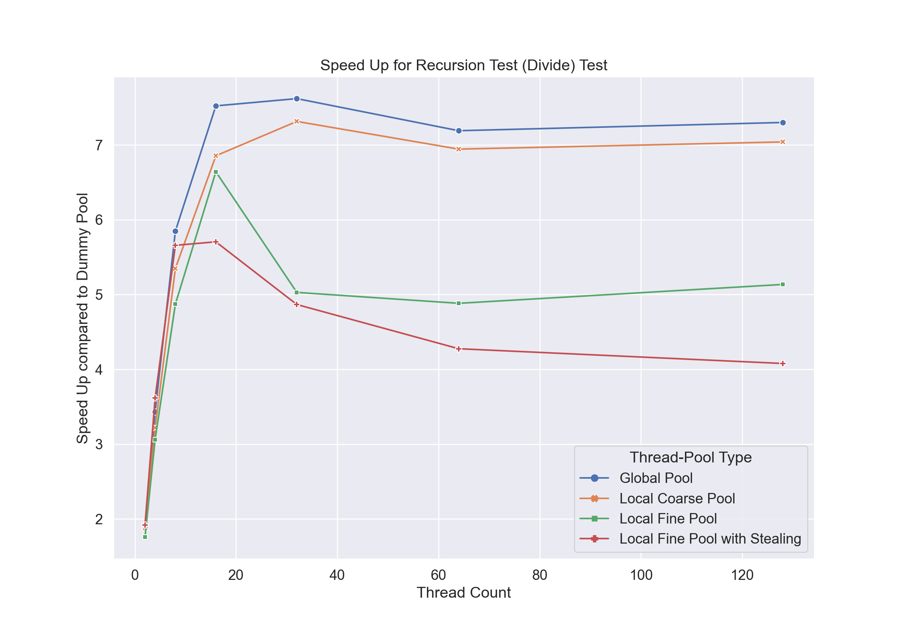
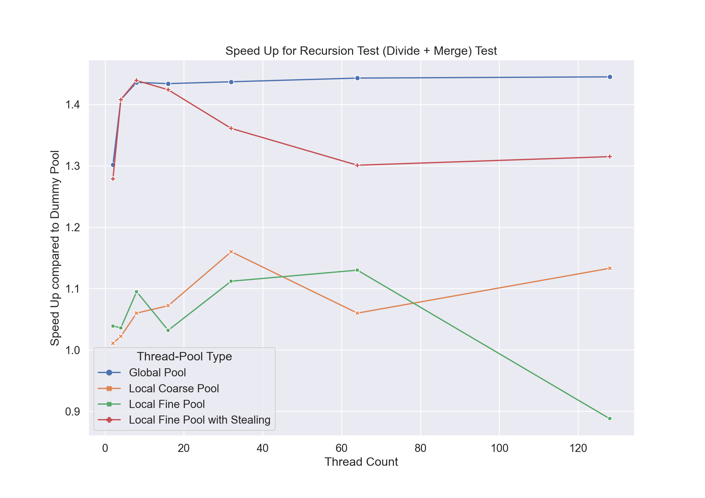

-----------------

### Zorro
This is Zorro, the implementation of a distributed threadpool with work stealing enabled. It builds on Linux OS and use C++17 as the programming language.

It aims to separate parallel task definition and execution. This should ease users' experience of executing multiple tasks in parallel by automatically managing the scheduling and work balancing while squeezing all the parallel performance out of the underlying hardware.

##### Authors
Yukun Jiang (yukunj) & Leo Guo (jiongtig)

---

#### Key Challenge

Firstly, load balancing is hard. Without knowing the exact workload of each task, the workload balancing has to been dynamically on the fly. This is why we need the work-stealing policy.

Secondly, with a distributed work queue, synchronization is challenging. The more workers in the threadpool, the higher the contention for critical data structure.

--- 

#### System Diagram

The final version, which is thread-local fine-grained locking queue with work stealing policy enabled, is illustrated in the diagram below for reference.

---

#### Performance Benchmark
We benchmark our systems on PSC super computer cluster ranging thread from 2, 4, 8, ... to 128, and on various workload.

---

#### Schedule

+ [x] **Week1**: Read related literature and setup repo build with base interface
+ [x] **Week2**: Build the global work queue version
+ [x] **Week3**: Build the distributed thread-local work queue version
+ [x] **Week4**: Enable work-stealing policy to enhance work balance
+ [x] **Week5**: Wrap up the project and prepare report & poster

